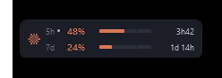
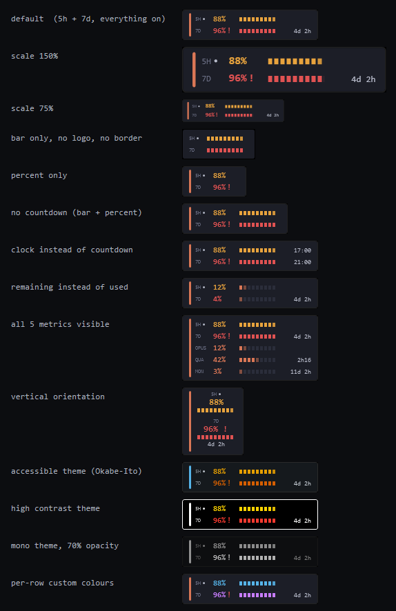
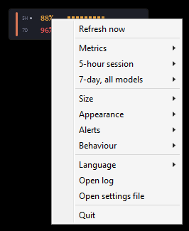

# Vibespan

A small always-on-top gauge for Windows showing how much of your Claude usage limits you
have burned through, and when they reset — with everything about it configurable from one
right-click.



It sits above the taskbar and never disappears behind it, because the executable is built
with the `uiAccess` privilege — the same one the Magnifier and the on-screen keyboard use.

## What makes it different

**It discovers what to show instead of hardcoding it.** The usage endpoint returns the same
information two ways — a generic `limits[]` array and a set of flat named keys — and neither
is guaranteed to be there. Vibespan merges both, so per-model weekly caps, extra-usage
credits, spend, and buckets nobody has documented yet all turn up in the menu on their own,
ready to be ticked on. Anthropic has changed these buckets repeatedly; a fixed list goes
stale within weeks.

**Everything is adjustable from the right-click menu.** Which metrics appear, whether each
one shows a number, a bar, a countdown or any combination, the reset format, colours per
row, four themes, size, opacity, orientation, alert thresholds.



## Features

- **Any metric the API exposes** — 5-hour session, 7-day, per-model weekly (Opus / Sonnet /
  Fable), OAuth apps, Cowork, extra credits, spend — discovered automatically
- **Marks the binding limit** with a dot, so you can see which one will actually bite
- **Six layout presets per row** — percent only, bar only, percent + bar, and so on
- **Countdown, clock time, or nothing** for each reset, per row
- **Show remaining instead of used**, per row
- **Resize by dragging the corner** or from the Size menu — the two snap to the same steps
- **Four themes** including a colour-blind-safe one, plus a custom colour per row
- **Horizontal or vertical** layout
- **Threshold alerts** at your chosen percentages, once per window, silent by default
- **Gets out of the way of games** — hides while a full-screen app is in front, including
  borderless-fullscreen, and stops re-asserting topmost so it cannot kick a game out of its
  display mode
- **Goes visibly stale** — amber then red border, gauges fade — when the data is more than
  12 minutes old, so a frozen number never looks like a fresh one
- **Tray icon** tinted by your worst limit, which is also how you get the widget back if you
  drag it onto a monitor you later unplug
- **Optional live feed** from Claude Code (see below) — instant updates, no polling
- **English, Français, Español, Deutsch**

## Requirements

- Windows 10 or 11
- .NET Framework 4.x (present on every supported Windows — nothing to install)
- [Claude Code](https://claude.com/claude-code) installed and signed in once

## Install

Paste this into **PowerShell** and accept the administrator prompt:

```powershell
irm https://raw.githubusercontent.com/stronxyo/vibespan/main/web-install.ps1 | iex
```

Or clone the repository and double-click `Installer.bat`.

### Without the administrator prompt

The admin step exists only to grant `uiAccess`, which is what keeps the widget above the
taskbar. If you would rather not have a local certificate on your machine at all:

```powershell
& ([scriptblock]::Create((irm https://raw.githubusercontent.com/stronxyo/vibespan/main/web-install.ps1))) -NoUiAccess
```

or, from a clone:

```powershell
powershell -ExecutionPolicy Bypass -File Installer.ps1 -NoUiAccess
```

This installs to `%LOCALAPPDATA%\Vibespan`, needs no administrator rights, and creates no
certificate. Everything works the same except that the taskbar can draw over the widget.
If your taskbar auto-hides you will barely notice.

### What the installer does

- Builds `src\*.cs` **on your machine** with the C# compiler already included in Windows.
  Nothing is downloaded and no build toolchain is needed.
- Creates a self-signed certificate `CN=Vibespan Local Signing`, trusts it on this machine,
  signs the executable, and then **deletes the private key**. See below.
- Copies the signed binary to `C:\Program Files\Vibespan\` and starts it **without**
  elevation.

## About that certificate

Windows grants `uiAccess` only to a binary whose signature chains to a trusted root **on
this machine** and which lives in an admin-only directory. Both, or the privilege is
refused. There is no gentler store — `Trusted People` satisfies MSIX installs but not
`uiAccess`. So an above-the-taskbar widget without a real code-signing certificate has to
create a local one, and **adding a root certificate is not a trivial change to your
machine**.

Three things narrow the risk, and they are worth knowing because plenty of tools that do
this do not bother:

1. The certificate is **EKU-constrained to Code Signing**. Windows honours that constraint,
   so it cannot be used to intercept TLS — only to sign code.
2. **Its private key is destroyed immediately after signing.** The signature on the
   installed binary is permanent and does not need the key again. Without the key, nothing —
   including anything that later compromises the machine — can sign new code against the
   trust you just granted. This is the part that actually matters.
3. `Uninstall.ps1` removes the certificate from all three stores and **verifies** that
   nothing is left.

If none of that appeals, use `-NoUiAccess`. It is a first-class mode, not a fallback.

## What it reads and writes

This program handles your Claude Code credentials. In full:

| Path | Access | Why |
|---|---|---|
| `%USERPROFILE%\.claude\.credentials.json` | read **and write** | reads the OAuth token to query usage; writes the refreshed token back (see below) |
| `%USERPROFILE%\.claude\settings.json` | write, **only if you enable the live feed** | adds/removes a `statusLine` entry |
| `%LOCALAPPDATA%\Vibespan\settings.json` | write | all your settings |
| `%LOCALAPPDATA%\Vibespan\tokens.json` | write | local token cache |
| `%LOCALAPPDATA%\Vibespan\feed.json` | write | live-feed scratch file |
| `%LOCALAPPDATA%\Vibespan\log.txt` | write | diagnostics, capped at 128 KB — **never contains tokens** |

**Why it writes back to `.credentials.json`:** the OAuth server rotates refresh tokens —
using one invalidates the previous. If the widget kept the new token to itself, Claude Code
would be left holding a dead token and would need a `/login` every few hours. Vibespan
patches `accessToken`, `refreshToken` and `expiresAt` back into the file, in place, leaving
every other field untouched.

Your tokens are sent to `api.anthropic.com`, `platform.claude.com` and
`console.anthropic.com`, and nowhere else. There is no telemetry.

The usage endpoint (`/api/oauth/usage`) is **not a documented public API**. It can change or
disappear without notice, and this project is not affiliated with Anthropic.

## The live feed (optional)

Claude Code pushes a JSON blob to its status-line command on every turn, and for Claude.ai
subscribers that blob contains the same 5-hour and 7-day numbers — pushed, unauthenticated,
and with no rate limit. It is strictly better than polling whenever Claude Code is running.

**Behaviour ▸ Use Claude Code live feed** wires it up by adding a `statusLine` entry to your
`~/.claude/settings.json`, and unticking it removes that entry again. If you already have a
status line configured, the menu item is disabled rather than overwriting it.

While enabled you also get a usage read-out inside Claude Code, since the widget has to
print *something* there.

## Customizing

Right-click the widget. Everything lives there:



- **Metrics** — tick which limits appear; reorder them
- **&lt;each visible metric&gt;** — layout preset, reset format, remaining-vs-used, colour
- **Size** — 75% to 200%, or drag the bottom-right corner (it snaps to the same steps)
- **Appearance** — theme, opacity, orientation, logo, border
- **Alerts** — thresholds, sound, mute for an hour
- **Behaviour** — full-screen hiding, click-through, autostart, live feed, bring to centre

Settings live in `%LOCALAPPDATA%\Vibespan\settings.json` and can be edited by hand
(**Open settings file**). It is versioned; a file from a newer build is backed up rather
than half-parsed.

## Troubleshooting

**The numbers stop updating.** Right-click → *Open log*. It gives the exact reason for the
last failure.

**It says rate limited.** The usage endpoint returns HTTP 429 with no `Retry-After` and can
stay unhappy for half an hour. Vibespan backs off rather than retrying harder, and never
polls faster than every 180 seconds. Running several usage tools at once shares one budget.

**Nothing refreshes at all, and the log shows timeouts.** The widget requests IPv4 on
purpose: on a router that advertises an IPv6 prefix without actually routing it, an IPv6
request hangs until the timeout. It switches back automatically if IPv6 is the only working
path.

**`Claude Code is not signed in`.** Run Claude Code once so `~/.claude/.credentials.json`
exists.

**The widget vanished.** Either a full-screen application is in the foreground and it comes
back on its own, or it is on a monitor you unplugged — left-click the tray icon to bring it
back. You can also turn off *Behaviour ▸ Hide in full-screen apps*.

**It stopped sitting above the taskbar.** The log line at startup says whether `uiAccess`
was granted. It is refused if the binary is moved out of `Program Files` or re-signed.

## Uninstall

```powershell
powershell -ExecutionPolicy Bypass -File "C:\Program Files\Vibespan\Uninstall.ps1"
```

Run it as administrator to remove the certificate too. It reports exactly what it removed,
what it left, and verifies no certificate remains. Add `-KeepSettings` to preserve your
configuration.

## Building and hacking

```powershell
csc.exe /target:winexe /out:Vibespan.exe /win32manifest:Vibespan.manifest /langversion:5 ^
  /r:System.dll /r:System.Core.dll /r:System.Xaml.dll ^
  /r:System.Windows.Forms.dll /r:System.Drawing.dll /r:Microsoft.CSharp.dll ^
  /r:...\WPF\PresentationFramework.dll /r:...\WPF\PresentationCore.dll /r:...\WPF\WindowsBase.dll ^
  src\*.cs
```

The in-box compiler is **C# 5 only** — no string interpolation, no `?.`, no `nameof` — and
cannot compile XAML, so the UI is all code. `/langversion:5` is passed deliberately so a
newer-syntax mistake fails on your machine rather than someone else's.

- `--demo <file>` renders a JSON fixture instead of calling the endpoint. Useful for
  screenshots and layout work, and it avoids tripping the rate limit.
- `tests\TestModel.cs` covers the parser and the bucket-merging logic (47 checks).
- `tests\variants.ps1` renders the widget under a set of configurations into one contact
  sheet.
- `docs/SPIKES.md` records the window-management experiments, including two designs that
  were **refuted** by measurement and what replaced them. Read it before changing anything
  about Z-order, the resize grip, or the menu.

### Adding a language

Everything lives in `src\I18n.cs`. Copy one of the blocks, translate the values, and append
it to `Catalog`. The language menu and the settings file are both driven by that array, so
there is nothing else to wire up.

## Credits

Vibespan began as a rewrite of [Defacedz/claude-usage-widget](https://github.com/Defacedz/claude-usage-widget)
and keeps several things that project got right the hard way — the `uiAccess` approach, the
in-place credential write-back, the borderless-fullscreen detection, and the idea that a
stale gauge should *look* stale. MIT, with the original copyright retained.

## License

MIT — see [LICENSE](LICENSE).
